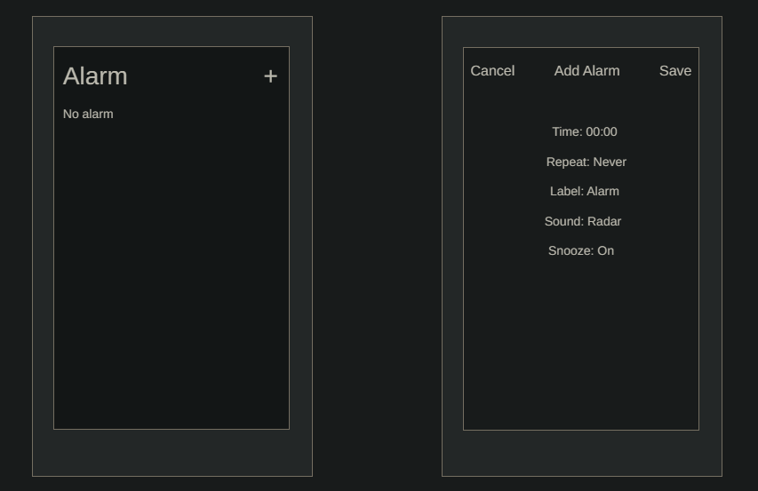
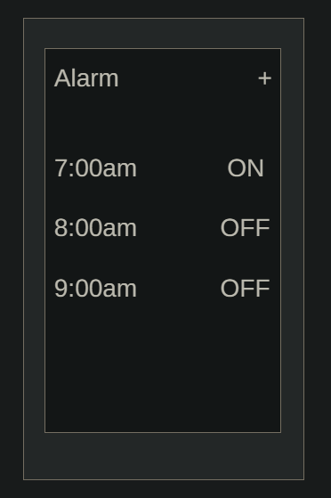
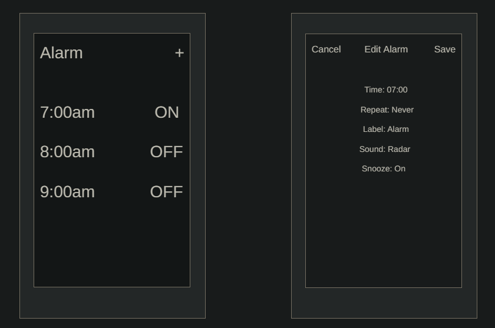
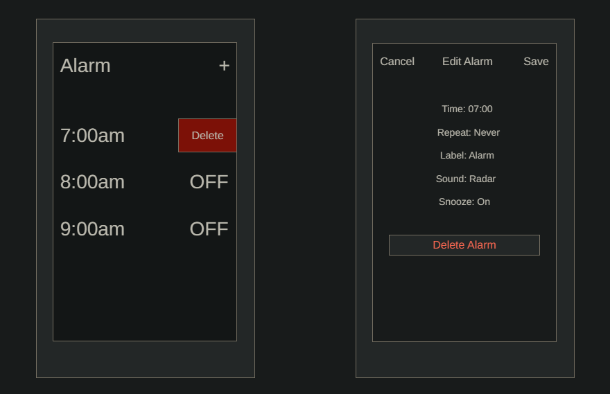

# `User Stories Demo: Phone Alarm`

## CREATE

### As a chronic oversleeper, I can set an alarm on my phone so I am jarringly awoken at a preordained time.

**Acceptance Criteria**
- [ ] A "+" button in the upper-right corner allows creation of a new alarm
- [ ] When the "+" button is pressed, an "Add Alarm" screen appears
- [ ] The "Add Alarm" screen has a form for the time, repeat status, label, alarm sound, and snooze options
- [ ] A "Save" button in the upper-right corner allows the alarm to be created
- [ ] A "Cancel" button in the upper-left corner allows the creation process to be aborted

## READ

### As an anxiety-riddled wreck, I can check the currently created and set alarms so I can futilely attempt to achieve some restful peace of mind.

**Acceptance Criteria**
- [ ] A list of currently created alarms appears on the main screen
- [ ] The list of alarms is scrollable
- [ ] Each alarm can be toggled on or off

## UPDATE

### As an indecisive overthinker, I can change the currently created alarms so I can frantically vacillate between ultimately insignificant differences.

**Acceptance Criteria**
- [ ] Any created alarm can be pressed to bring up an "Edit Alarm" screen
- [ ] The "Edit Alarm" screen has the same options as the "Add Alarm" screen
- [ ] A "Save" button in the upper-right corner allows the alarm to be updated
- [ ] A "Cancel" button in the upper-left corner allows the update process to be aborted

## DELETE

### As a disappointment to my parents, I can delete my currently set alarms so I can blow off whatever tomorrow’s obligations may be.
**Acceptance Criteria**
- [ ] Any created alarm can be swiped to the left to reveal a red "Delete" button
- [ ] When the "Delete" button is pressed, the alarm in question is removed
- [ ] Additionally, on the "Edit Alarm" screen, a "Delete Alarm" option is present under the other alarm options

